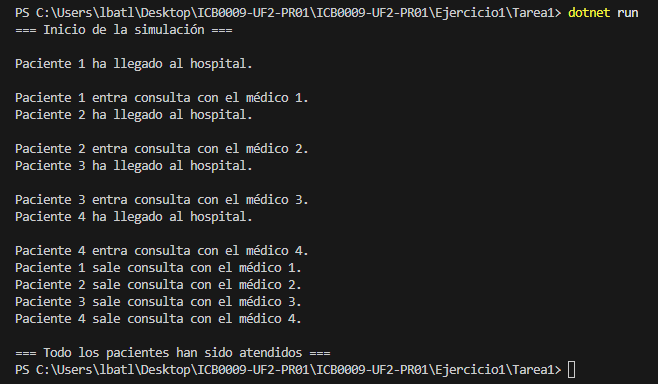

# Ejercicio 1 - Tarea 1: Simulación de Consulta Médica

## Propósito del Código

Este programa simula cómo llegan 4 pacientes al hospital y son atendidos por 4 médicos. Uso .NET 8 porque es lo que vamos a usar en toda la práctica. Los pacientes llegan cada 2 segundos, y cada médico tarda 10 segundos en atender. Los médicos se asignan al azar (del 1 al 4), y si uno está ocupado, no puede atender a otro paciente. Muestro mensajes cuando un paciente llega, entra en consulta y sale.

## Explicación Técnica

- **Main:** Creo una lista de hilos para los 4 pacientes. Cada hilo usa el método `AtenderPaciente` con el número del paciente (1, 2, 3 o 4). Pongo `Thread.Sleep(2000)` para que lleguen cada 2 segundos.
- **AtenderPaciente:** Muestra que el paciente llega, busca un médico libre en un array `medicosOcupados` (true si está ocupado). Uso `lock` para que no se pisen los hilos. Si encuentra médico, lo ocupa, espera 10 segundos (`Thread.Sleep(10000)`), y lo libera.
- **Random:** Uso `Random` para asignar médicos al azar, pero como hay 4 médicos y 4 pacientes, todos encuentran uno.

## Respuestas a las Preguntas

### ¿Cuántos hilos se están ejecutando en este programa? Explica tu respuesta

Hay **5 hilos**. Hay un hilo principal (el `Main`) que controla todo, y luego creo 4 hilos más, uno por cada paciente. Cada paciente va en su propio hilo porque uso `Thread.Start()`.

### ¿Cuál de los pacientes entra primero en consulta? Explica tu respuesta

El **Paciente 1** entra primero. Llegan en orden cada 2 segundos (Paciente 1 a los 0s, Paciente 2 a los 2s, etc.), y como hay 4 médicos libres al empezar, el Paciente 1 siempre coge un médico y entra enseguida. En la salida se ve que su mensaje de "entra en consulta" sale primero.

### ¿Cuál de los pacientes sale primero de consulta? Explica tu respuesta

El **Paciente 1** sale primero también. Entra a los 0 segundos y tarda 10 segundos, así que sale a los 10 segundos. El Paciente 2 entra a los 2 segundos y sale a los 12 segundos, y así con los otros. Como todos tardan lo mismo (10 segundos), el que entra primero sale primero.

