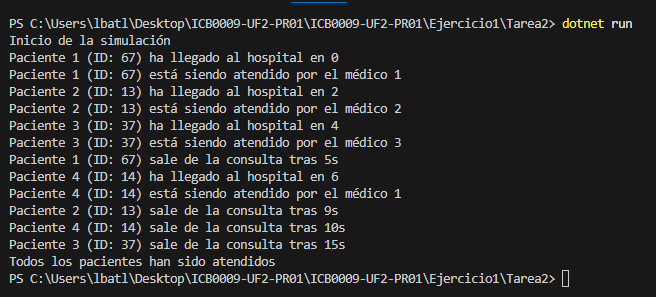

# Ejercicio 1 - Tarea 2: Pacientes con Datos

## Propósito del Código

Este programa simula 4 pacientes que llegan al hospital con datos diferentes. Cada uno tiene un ID único (aleatorio de 1 a 100), un tiempo de llegada (0, 2, 4, 6 segundos), un tiempo de consulta (aleatorio entre 5 y 15 segundos) y un estado (Espera, Consulta, Finalizado). Uso .NET 8 y muestro mensajes con el ID, el número de llegada y lo que pasa con cada paciente.

## Explicación Técnica

- **Versión:** Hecho con .NET 8, lo creé con `dotnet new console -f net8.0`.
- **Clase Paciente:** Tiene `Id`, `LlegadaHospital`, `TiempoConsulta` y `Estado` (0 = Espera, 1 = Consulta, 2 = Finalizado). El constructor pone todo lo que le pasas.
- **Main:** Creo 4 pacientes con datos aleatorios. Cada uno llega cada 2 segundos (uso `Thread.Sleep(2000)`). Cada paciente va en su propio hilo.
- **AtenderPaciente:** Muestra cuando llega el paciente, busca un médico libre en `medicosOcupados` (un array de 4), lo ocupa, espera el tiempo de consulta y lo libera. Cambio el `Estado` a 1 cuando entra y a 2 cuando sale.

## Respuesta a la Pregunta

### ¿Cuál de los pacientes sale primero de consulta? Explica tu respuesta

No siempre sale el mismo paciente primero porque el tiempo de consulta es aleatorio (entre 5 y 15 segundos). Pero normalmente el **Paciente 1** tiene más chances de salir primero. Esto es porque llega primero (a los 0 segundos), entra en consulta сразу (hay 4 médicos libres), y si su tiempo de consulta es corto (por ejemplo, 5 segundos), sale a los 5 segundos. El Paciente 2 llega a los 2 segundos, y aunque tenga un tiempo corto, suele salir después (por ejemplo, a los 7 segundos si son 5 segundos de consulta). En la captura se ve que el Paciente 1 salió primero esta vez, pero depende de los números aleatorios.

## Captura de Pantalla

Aquí está la captura de la salida. La hice con "Imp Pant" y la pegué abajo.

---

*(Nota: Aquí iría la imagen pegada y ajustada si fuera necesario)*   
