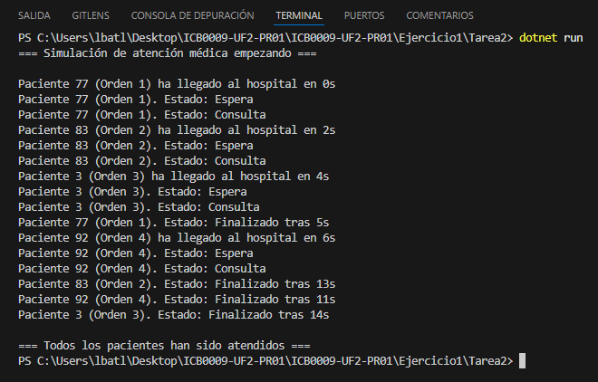

# Ejercicio 1 - Tarea 2: Pacientes con Datos

## Propósito del Código
Este programa simula 4 pacientes que llegan al hospital cada 2 segundos, con ID único (1-100), tiempo de llegada (0, 2, 4, 6 segundos) y tiempo de consulta (5-15 segundos). Tienen estados (Espera, Consulta, Finalizado).

## Explicación Técnica
- **Clase Paciente:** Tiene `Id` (aleatorio), `LlegadaHospital` (0, 2, 4, 6), `TiempoConsulta` (aleatorio 5-15 segundos) y `Estado` (0 = Espera, 1 = Consulta, 2 = Finalizado).
- **Main:** 
  - Uso un `for` para crear 4 pacientes, cada uno con su hilo (`Thread`) guardado en `List<Thread>`.
  - Espero 2 segundos entre llegadas con `Thread.Sleep(2000)` y al final uso `Join()` para esperar a todos.
- **AtenderPaciente:** 
  - Uso `SemaphoreSlim` con 4 médicos. `Wait()` espera uno libre y `Release()` lo libera.
  - Cambio el `Estado` del paciente y muestro mensajes con un delegate `MostrarMensaje`.

  ## Respuesta a la Pregunta

### ¿Cuál de los pacientes sale primero de consulta? Explica tu respuesta.
No siempre sale el mismo porque el tiempo de consulta es aleatorio (5-15 segundos). Pero el **Paciente 1** tiene más probabilidades de salir primero.

## Captura de Pantalla
Aquí está la captura de la salida.

