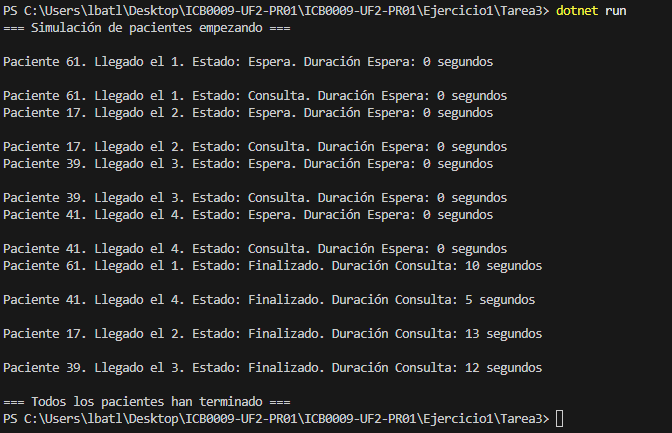

# Ejercicio 1 - Tarea 3: Visualización del Avance

## Propósito del Código

Este programa simula 4 pacientes que llegan al hospital y muestra sus cambios de estado (Espera, Consulta, Finalizado) con su ID, orden de llegada (1 a 4) y el tiempo entre cambios.

## Explicación Técnica

- **Clase Paciente:** Tiene `Id` (aleatorio 1-100), `LlegadaHospital` (0, 2, 4, 6 segundos), `TiempoConsulta` (aleatorio 5-15 segundos) y `Estado` (0 = Espera, 1 = Consulta, 2 = Finalizado).
- **Main:** Creo 4 pacientes con hilos. Cada uno llega cada 2 segundos (`Thread.Sleep(2000)`).
- **AtenderPaciente:**
  - Muestra el estado "Espera" al llegar con duración 0 (no esperan porque hay médicos libres).
  - Cambia a "Consulta" y muestra el mensaje.
  - Espera el tiempo de consulta y cambia a "Finalizado", mostrando la duración de la consulta.

## Respuesta a la Pregunta

### ¿Has decidido visualizar información adicional a la planteada en el ejercicio? ¿Por qué? Plantea qué otra información podría ser útil visualizar

No he puesto información extra más allá de lo que pide el enunciado. Solo muestro el ID, el orden de llegada, el estado y las duraciones como en el ejemplo (Duración Espera y Duración Consulta). Lo hice así para seguir exactamente lo que me pedían y no complicarme.  
Otra información que podría ser útil:  

- **Número del médico:** Mostrar qué médico atiende a cada paciente (ej. "Médico 2") para ver cómo se asignan.  
- **Tiempo total:** Cuánto tiempo pasa desde que llega hasta que termina, sumando espera y consulta.  
Esto podría ayudar a entender mejor cómo funciona el programa, pero no lo añadí porque no me lo pedían.

## Captura de Pantalla

Aquí está la captura de la salida. La hice con "Imp Pant" y la pegué abajo.

---

