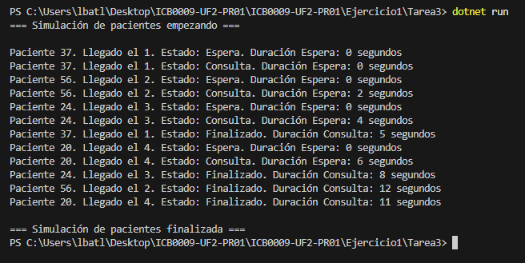

# Ejercicio 1 - Tarea 3: Visualización del Avance

## Propósito del Código

Este programa simula 4 pacientes que llegan al hospital cada 2 segundos, con ID (1-100), tiempo de llegada (0, 2, 4, 6) y tiempo de consulta (5-15 segundos). Muestro sus estados (Espera, Consulta, Finalizado) con orden de llegada y duración.

## Explicación Técnica

- **Clase Paciente:** Tiene `Id` (aleatorio), `LlegadaHospital` (0, 2, 4, 6), `TiempoConsulta` (aleatorio 5-15 segundos) y `Estado` (0 = Espera, 1 = Consulta, 2 = Finalizado).
- **Main:**
  - Uso un `for` para crear 4 pacientes, cada uno con un hilo en `List<Thread>`.
  - Espero 2 segundos entre llegadas con `Thread.Sleep(2000)` y uso `Join()` para esperar a todos.
- **AtenderPaciente:**
  - Uso `SemaphoreSlim` con 4 médicos. `Wait()` espera uno libre y `Release()` lo libera.
  - Cambio el `Estado` y muestro mensajes con un delegate `MostrarMensaje`.

## Respuesta a la Pregunta

### ¿Has decidido visualizar información adicional a la planteada en el ejercicio? ¿Por qué? Plantea qué otra información podría ser útil visualizar

No he puesto nada extra, solo muestro ID, orden de llegada, estado y duración como pide el enunciado.
Podría ser útil añadir:

- **Número del médico:** Para ver quién atiende a cada paciente (ej. "Médico 2").
- **Tiempo exacto:** El segundo en que pasa cada cambio para seguir el orden.
- **Total de tiempo:** Cuánto tardó desde que llegó hasta que terminó.

- **Total de tiempo:** Cuánto tardó desde que llegó hasta que terminó.

## Captura de Pantalla

Aquí está la captura de la salida.

