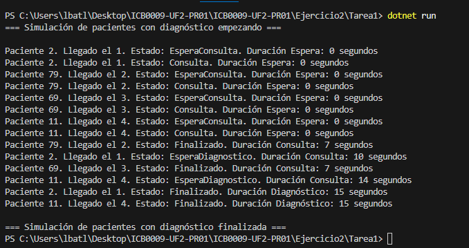

# Ejercicio 2 - Tarea 1: Unidades de Diagnóstico

## Propósito del Código

Este programa simula 4 pacientes que llegan al hospital cada 2 segundos. Tienen consulta (5-15 segundos) y, si lo necesitan (50% de probabilidad), usan una de 2 máquinas de diagnóstico (15 segundos). Muestro estados (EsperaConsulta, Consulta, EsperaDiagnostico, Finalizado).

## Explicación Técnica

- **Clase Paciente:** Tiene `Id` (aleatorio), `LlegadaHospital` (0, 2, 4, 6), `TiempoConsulta` (5-15 segundos), `Estado` (0 = EsperaConsulta, 1 = Consulta, 2 = EsperaDiagnostico, 3 = Finalizado) y `RequiereDiagnostico` (true/false aleatorio).
- **Main:**
  - Uso `for` para crear 4 pacientes, cada uno con un hilo en `List<Thread>`.
  - Espero 2 segundos entre llegadas con `Thread.Sleep(2000)` y uso `Join()` al final.
- **AtenderPaciente:**
  - Uso `SemaphoreSlim` con 4 médicos y otro con 2 máquinas. `Wait()` espera recurso libre y `Release()` lo libera.
  - Cambio `Estado` y muestro mensajes con un delegate `MostrarMensaje`.

  ## Respuesta a la Pregunta

### ¿Los pacientes que deben esperar para hacerse las pruebas diagnóstico entran luego a hacerse las pruebas por orden de llegada? Explica qué tipo de pruebas has realizado para comprobar este comportamiento

Sí, entran por orden de llegada porque terminan consulta en orden (llegan cada 2 segundos y hay 4 médicos), y luego buscan una máquina. Con solo 2 máquinas, los primeros 2 que necesitan diagnóstico las toman, y los siguientes esperan.
**Pruebas:** Corrí el programa varias veces y miré la salida. Si Paciente 1 y 2 necesitan diagnóstico, ocupan las máquinas primero. Paciente 3 espera hasta que una se libera (después de 15 segundos). El orden (1, 2, 3, 4) se mantiene porque los hilos van en secuencia y los semáforos controlan el acceso.

## Captura de Pantalla

