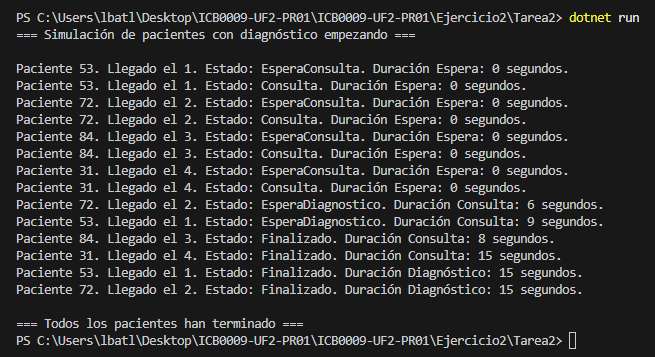

# Ejercicio 2 - Tarea 2: Unidades de Diagnóstico - Sincronización

## Propósito del Código

Este programa simula 4 pacientes que llegan al hospital cada 2 segundos. Tienen consulta (5-15 segundos) y, si lo necesitan (50% de probabilidad), usan una de 2 máquinas de diagnóstico (15 segundos) en orden de llegada (1, 2, 3, 4).

## Explicación Técnica

- **Clase Paciente:** Tiene `Id`, `LlegadaHospital`, `TiempoConsulta`, `Estado` (0 = EsperaConsulta, 1 = Consulta, 2 = EsperaDiagnostico, 3 = Finalizado) y `RequiereDiagnostico`.
- **Main:**
  - Uso `for` para crear 4 pacientes con hilos en `List<Thread>`.
  - Espero 2 segundos entre llegadas y uso `Join()` al final.
- **AtenderPaciente:**
  - Uso `SemaphoreSlim` para 4 médicos y 2 máquinas.
  - Para diagnóstico, uso `lock` con `turnoDiagnostico`. Si no es el turno, espera 100 ms y chequea de nuevo.

## Respuesta a la Pregunta

### Explica la solución planteada en tu código y por qué las has escogido

Uso una variable `turnoDiagnostico` que empieza en 1 y un bucle con `lock` . Cada paciente chequea si `turnoDiagnostico` es su `numeroLlegada` . Si no, espera 100 ms con `Thread.Sleep(100)` y vuelve a mirar. Cuando es su turno, usa una máquina, sube el turno y sigue.
Use los `lock` que evita que los pacientes se pisen, y el `Sleep` para que no se use el procesador mientras se espera.

### Plantea otra posibilidad de solución a la que has programado

Podría usar una `List<Pacientes>` como cola. Cuando un paciente termina una consulta y se necesita diagnóstico, se añade a la cola. El hilo miraría a la cola y asignaria una máquina en orden. Sería más realista pero tendrías que crear otro hilo.

## Captura de Pantalla

