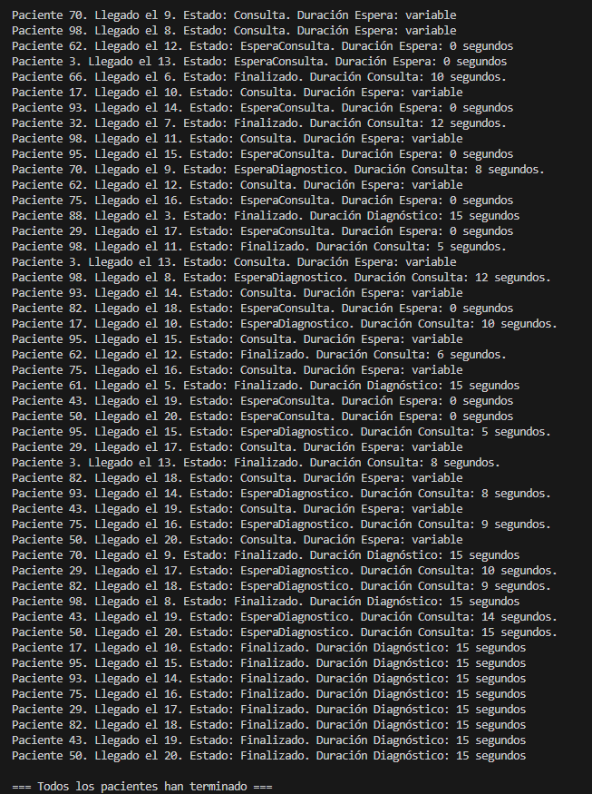

# Ejercicio 2 - Tarea 3: Más Pacientes

## Propósito del Código

Este programa simula 20 pacientes que llegan al hospital cada 2 segundos, con 4 médicos (5-15 segundos por consulta) y 2 máquinas de diagnóstico (15 segundos si lo necesitan, 50% de probabilidad). Los pacientes esperan si no hay médicos libres.

## Explicación Técnica

- **Clase Paciente:** Tiene `Id` (aleatorio), `LlegadaHospital` (0, 2, ..., 38), `TiempoConsulta` (5-15 segundos), `Estado` (0 = EsperaConsulta, 1 = Consulta, 2 = EsperaDiagnostico, 3 = Finalizado) y `RequiereDiagnostico` (aleatorio).
- **Main:**
  - Uso `for` para crear 20 pacientes con hilos en `List<Thread>`.
  - Espero 2 segundos entre llegadas con `Thread.Sleep(2000)` y uso `Join()` al final.
- **AtenderPaciente:**
  - Uso `SemaphoreSlim` con 4 médicos y 2 máquinas. `Wait()` bloquea si no hay recursos libres.
  - Cambio `Estado` y muestro mensajes con un delegate `MostrarMensaje`.

## Respuesta a la Pregunta 1

### Explica el planteamiento de tu código y plantea otra posibilidad de solución a la que has programado y porqué has escogido la tuya

Uso `SemaphoreSlim` para limitar a 4 médicos y 2 máquinas. Los pacientes llegan cada 2 segundos y, si no hay médicos libres, esperan en `EsperaConsulta` hasta que `semaforoMedicos.Wait()` los deja pasar. Luego, si necesitan diagnóstico, esperan una máquina con `semaforoMaquinas.Wait()`. Todo va en hilos guardados en `List<Thread>`.
**Otra posibilidad:** Podría usar una `Queue<Paciente>` para meter a los pacientes que llegan y sacarlos con `Dequeue()` cuando haya un médico libre. Un hilo separado gestionaría la cola y asignaría médicos y máquinas.

## Respuesta a la Pregunta 2

### ¿Los pacientes que deben esperar entran luego a la consulta por orden de llegada? Explica qué tipo de pruebas has realizado para comprobar este comportamiento.
Sí, entran por orden de llegada porque los hilos se crean en orden (1, 2, ..., 20) y `semaforoMedicos.Wait()` los deja pasar en ese orden cuando hay médicos libres. Los primeros 4 entran directo, y los siguientes esperan hasta que un médico se libera, respetando la fila.

## Captura de Pantalla
