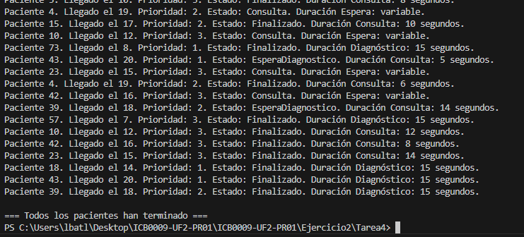

# Ejercicio 2 - Tarea 4: Prioridades de los Pacientes

## Propósito del Código
Este programa simula 20 pacientes que llegan al hospital cada 2 segundos, con 4 médicos (5-15 segundos por consulta) y 2 máquinas de diagnóstico (15 segundos si lo necesitan, 50% de probabilidad). Cada paciente tiene una prioridad (1 = Emergencias, 2 = Urgencias, 3 = Consultas generales). Los pacientes en espera entran por orden de prioridad y, dentro de la misma prioridad, por orden de llegada.

## Explicación Técnica
- **Clase Paciente:** Tiene `Id`, `LlegadaHospital` (0, 2, ..., 38), `TiempoConsulta` (5-15 segundos), `Estado` (0 = EsperaConsulta, 1 = Consulta, 2 = EsperaDiagnostico, 3 = Finalizado), `RequiereDiagnostico` y `Prioridad` (1, 2, 3 aleatorio).
- **Main:** 
  - Uso `for` para crear 20 pacientes con hilos en `List<Thread>`.
  - Espero 2 segundos entre llegadas con `Thread.Sleep(2000)` y uso `Join()` al final.
- **AtenderPaciente:** 
  - Añade el paciente a `pacientesEnEspera` con `lock`.
  - Un bucle chequea si es el siguiente según `Prioridad` y `LlegadaHospital` (usando LINQ). Si hay médico libre (`Wait(0)`), lo saca de la lista y pasa a consulta.
  - Uso `SemaphoreSlim` para 4 médicos y 2 máquinas.

  ## Respuesta a la Pregunta

### Explica el planteamiento de tu código y plantea otra posibilidad de solución a la que has programado y porqué has escogido la tuya.
Uso una lista `List<Paciente>` (`pacienteEnEspera`) donde meto los pacientes al llegar. Con un `lock` , un bucle comprueba quién es el siguiente según prioridad (1 primero) y orden de llegada (usando `OrderBy` y `ThenBy`). Si hay médico libre (`semaforoMedicos.Wait(0)`), pasa a consulta. Luego, si necesita diagnóstico, usa una máquina.
**Otra posibilidad:** Podría usar tres colas separadas (`Queue<Paciente>`) para cada prioridad (Emergencias, Urgencias, Consultas). Un hilo separado miraría primero la cola de prioridad 1, luego 2, luego 3, sacando pacientes por orden de llegada dentro de cada cola.

## Captura de Pantalla
